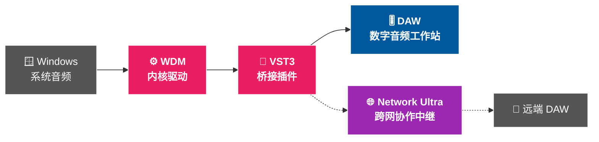

<!-- GitHub Profile README · 渲染于 https://github.com/GeekASMR -->

<!-- ─────────────────────────  顶部 Banner（保留）  ───────────────────────── -->

<!-- ─────────────────────────  关键词堆叠（新增）  ───────────────────────── -->

<picture>
  <source media="(prefers-color-scheme: dark)" srcset="https://raw.githubusercontent.com/GeekASMR/GeekASMR/main/keywords-dark.svg">
  
</picture>

<!-- ─────────────────────────  打字机 + 状态 ─────────────────────────────── -->

📍 哈尔滨 &nbsp;·&nbsp; 🌐 [geek.asmrtop.cn](https://geek.asmrtop.cn/) &nbsp;·&nbsp; 💚 [赞助 WHQL 签名](https://ultra.asmrtop.cn/donate/)

<!-- 主页访问改用 visitor-badge.laobi.icu（不易被墙、中文 label 不会截断） -->

---

### 🎯 我在做什么

把 Windows 系统音频以**采样级精度**送进 DAW，再让它跨越公网与协作者实时同步。

---

### 🚀 旗舰项目 — WDM2VST Ultra

WDM 内核驱动 + 5 个 VST3，把任意 Windows 程序的声音变成 DAW 里的一条轨道，反向亦可。低延迟、零拷贝 IPC、原生 VST3 宿主。

> **⚡ 阶段重点 — 推动微软 WHQL 签名**
>
> 国内主流反作弊（腾讯 ACE / 网易易盾 / EasyAntiCheat）默认拒签内核驱动。WHQL 是行业里**唯一彻底**的解法。
>
> 如果 WDM2VST Ultra 帮到你，欢迎 [💚 赞助一份心意](https://ultra.asmrtop.cn/donate/)。

---

### 🧰 项目矩阵

<table>
<tr>
<td valign="top" width="50%">

**🔊 音频内核 & 驱动**
- [`WDM2VST-Ultra`](https://github.com/GeekASMR/WDM2VST-Ultra) — WDM ↔ VST3 低延迟桥
- [`UMC-Ultra-drivers`](https://github.com/GeekASMR/UMC-Ultra-drivers) — 百灵达 UMC 虚拟跳线增强
- [`ASIO-Ultra-drivers`](https://github.com/GeekASMR/ASIO-Ultra-drivers) — ASIO 录音卡虚拟通道

**🌐 网络音频**
- [`network-ultra-server`](https://github.com/GeekASMR/network-ultra-server) — 跨网点协作中继（Go，一行命令自部署）

</td>
<td valign="top" width="50%">

**🎛 DAW 工具链**
- [`UA-LUNA-Simplified-Chinese-Patch`](https://github.com/GeekASMR/UA-LUNA-Simplified-Chinese-Patch) — UA LUNA 中文化
- [`UAD-Plugin-Manager`](https://github.com/GeekASMR/UAD-Plugin-Manager) — UAD 插件管理器

**🍎 黑苹果 OpenCore**
- Z370 / Z390 Phantom ITX 等多套配置（仓库后缀 `*-OpenCore-Hackintosh`）

**🪟 顺手做的小工具**
- [`window-drawer`](https://github.com/GeekASMR/window-drawer) — Windows 抽屉式窗口管理

</td>
</tr>
</table>

完整仓库列表 → <https://github.com/GeekASMR?tab=repositories>

---

### 🛠 常用工具链

  
  
  
  
  

  
  
  
  
  

---

### 📊 数据可视化

 

---

统计图来自 <a href="https://github.com/anuraghazra/github-readme-stats">github-readme-stats</a> · <a href="https://github.com/DenverCoder1/github-readme-streak-stats">streak-stats</a> · <a href="https://github.com/ryo-ma/github-profile-trophy">github-profile-trophy</a>，已开启简体中文 locale。 
关键词云 SVG 由仓库内 <code>scripts/gen_keywords.py</code> 一次性生成（不依赖外部服务，永远不会 404）。徽章实时数据来自 shields.io，缓存约 1 小时。

  

